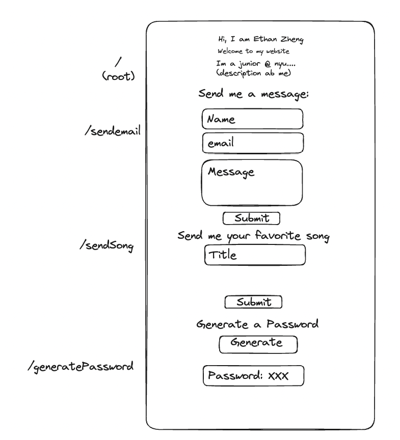
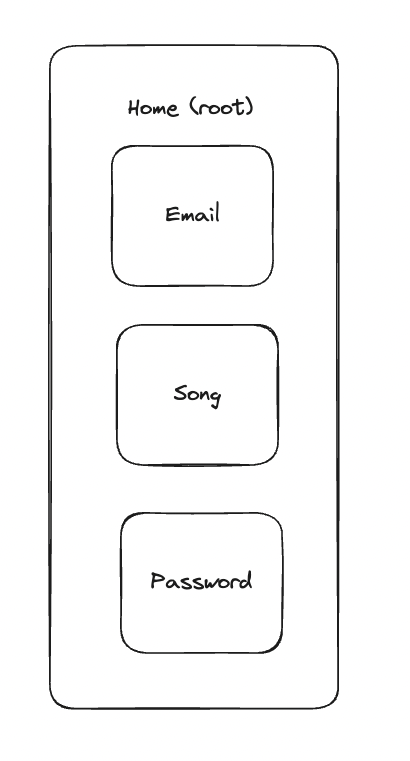

# Ethan's personal website 

## Overview

I am going to make a personal website. This site will have a homepage that describes me, images of my personal projects, as well as a mulitple forms and the ability to send me an email. 

My forms will take the users name and email as well as a message form. Once they submit, I will store the user's name and email into my mongoDB database, and I will forward the message to my email (currently considering forwarding the email from my own address along with their information). This way users can send me a message without ever needing my email and simply by submitting the form. 

## Data Model

The application will store Users, Lists and Items

* users can have multiple lists (via references)
* each list can have multiple items (by embedding)

(__TODO__: sample documents)

An Example User:

{
  name: "john smith",
<<<<<<< HEAD
<<<<<<< HEAD
  email: "" 
=======
  email: "johnsmith@gmail.com" 
>>>>>>> 65b44bfde76c386d4975e242067818461fa9945a
=======
  email: "johnsmith@gmail.com" 
>>>>>>> 23e7a527e00517acf381355fee2d8f663f2655dd
  message: "hello ethan"
}

## [Link to Commented First Draft Schema](db.mjs) 

## Wireframes

## Site Map

## User Stories or Use Cases

(__TODO__: write out how your application will be used through [user stories](http://en.wikipedia.org/wiki/User_story#Format) and / or [use cases](https://en.wikipedia.org/wiki/Use_case))

1. as underclassmen, I can send Ethan a request to chat
2. as a tech enthusiast, I can chat with Ethan about one of his projects
3. as a recruiter, I can reach out to Ethan directly and check out his experience
4. as a professional, I can ask Ethan about his experiences
## Research Topics

(__TODO__: the research topics that you're planning on working on along with their point values... and the total points of research topics listed)

* (5 points) React
    * Use React as the Front-end framework
* (3 points) Material UI React Framework
    * Use Material UI to generate components and animate

## [Link to Initial Main Project File](app.mjs) 

## Annotations / References Used

